DOI：10.19816/j.cnki.10-1594/tn.2020.02.127

# ADS技术的发展与应用

张洪术，王 丹，邱 云，赵合彬，杨瑞智，孙 晓，尤 杨，吴 俊，刘晓茹

（北京京东方显示技术有限公司 北京 100176）

摘 要：液晶显示技术作为目前市占率最高的显示技术具有极其广阔的应用场景，其中超维场转换技术（advanceddimension of switching ，ADS）在边缘场转换技术（fringe field switching ，FFS）的基础上不断创新发展 ，已经成为主流商用液晶显示技术。回顾了ADS技术的演化发展史，从像素结构和液晶光学角度出发，分析ADS技术具有高透过率、广视角、低色偏等。在创新应用方面，搭配ADS技术的全屏内触控（full in cell touch）技术在touch panel、信赖性、亮度、PPI等方面较其他技术具有明显优势。同时，在高端显示领域自主研发的65 in UHD BD Cell（dual cell local dimming）具有15000：1 的超高对比度，百万级的控光单元数，相比于目前主流的直下式 LED local dimming 方案，不仅显示更加细腻，而且外观轻薄美观。

关键词：ADS技术；高透过率；广视角；低色偏

中图分类号：TN141.9

文献标识码：A

国家标准学科分类代码：510

# The development and application of ADS technology

ZHANG Hongshu, WANG Dan, QIU Yun, ZHAO Hebin,

YANG Ruizhi, SUN Xiao, YOU Yang, WU Jun, LIU Xiaoru

(Beijing BOE Display Technology Co.,Ltd.,Beijing 100l76, China)

Abstract：Liquid crystal display technology as the highest rate display technology of market share has extremely broad application scenarios, including ADS (Advanced Dimension of Switching) that continuous innovation and development on the basis of FFS (Fringe Field Switching), has become the mainstream commercial liquid crystal display technology. This article reviews the evolution history, from the pixel structure and liquid crystal optical perspective, analysis of ADS technology with high transmittance, viewing Angle, low color shift characteristics. In terms of innovative applications, Full In Cell Touch technology which uses ADS technology has obvious advantages in respect of touch panel, reliability, brightness, PPI than other technology. At the same time, in the field of high-end display, 65 inch UHD BD Cell (dual Cell local dimming) which independently developed by BOE, has 15000:1 high contrast, millions of control light units, compared to the current mainstream direct type LED local dimming solution, displays more exquisite, and owns light and thin appearance.

Keywords：ADS technology; high transmittance; wide view angle; low color shift

# 0 引 言

奥地利植物学家弗里德里希.雷里特在1888年

发现一种物质，把它加热溶解到特定的温度时，就会变成透明液体，降到特定温度时又会成为固态晶体。其后不久，德国物理学家D.莱曼研究发现，处于

这两个温度间的浑浊中间态有一种特别的晶体分子结构，于是把处于这个状态的化合物称为液晶。

绝大多数液晶分子呈棒状或条形状，如图1所示。其分子结构细长，且一般由侧链、环结构和端基组成，这样的分子结构赋予了液晶分子同时具有光学各向异性和介电各向异性两种性能。棒状结构使之具有光学各向异性（双折射），具有偏光功能，其偏光性能受双折射率之差 $\Delta n$ 影响；而端基容易吸引电子，造成液晶分子中正电荷和负电荷中心不重合，相当于一个等效偶极子[1]。在外加电场的作用下，产生电偶极矩并驱动液晶分子转动。

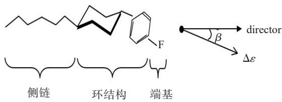  
图1液晶分子基本结构  
Fig.1 The basic structure of liquid crystal molecule

液晶这种优异的电光调制性使之成为绝佳的显示材料之一。

# 1 液晶显示技术的起源及发展

# 1.1 LCD 产业发展布局[2]

1968年，美国RCA公司展示了一台实物大小的液晶平板电视模型，尽管只能显示静态的单色图像，却在新闻界引起了轩然大波。

$1 9 7 1 \sim 1 9 9 1$ 年，日本液晶显示工业开端。1983年精工宣布LCD彩电研制成功，1987年夏普3 in液晶电视投入生产，次年10月，夏普在日本电子展览会上展示了14 in的液晶显示屏，引起轰动。

1991～1996年，日本成就液晶帝国，上下游产业链完善。NEC最先于1990年8月，然后是IBM与东芝的合资企业DTI公司于1991年8月，以及夏普于同年秋季，相继开动了他们各自的第一条大尺寸彩色TFT-LCD的量产线。在这期间全球至少有25家大批量生产线建成，其中21条建在日本，日本成为TFT-LCD工业主导者，其全球市场份额高达 $9 5 \%$ 以

上。

$1 9 9 5 \small { \sim } 1 9 9 6$ 年，液晶产业进入衰退期，韩国企业通过反周期投资进入液晶显示产业。

1999年韩国弯道超车，市场份额超过日本，当年三星全球平板显示器市场的份额达到 $1 8 . 8 \%$ ，名列第一，LG达到 $1 6 . 2 \%$ ，名列第二，均超过了原来的龙头日本夏普。

1997年爆发亚洲金融危机，韩元的大幅贬值提高了韩国企业的竞争力，大量TFT-LCD进入中国台湾市场，逼迫三菱、东芝、IBM日本、夏普和松下等日本企业开始中国台湾地区本地化生产，转移技术给中国台湾合作伙伴。

2004年，中国台湾液晶面板超过140亿美元销售额，其中中国大陆占到 $6 7 . 1 \%$ 。

$2 0 0 0 { \sim } 2 0 0 8$ 年，上广电、京东方、昆山龙腾进入液晶产业。

2008年全球金融危机，国内液晶面板企业逆势扩张，打响了产业反击战。

2009年京东方北京8.5代线奠基，日韩、中国台湾放弃对中国大陆液晶的封锁。

至今中国大陆已具有大世代生产线8/8.5代线11条、10/10.5代线4条，已成为世界TFT LCD工业绝对的领导者。液晶显示产业布局示意图，如图2所示。

# 1.2 ADS显示模式的演变

2003年1月，北京京东方收购了韩国现代电子的液晶业务，成立BOE-Hydis公司，并对现有FFS显示模式进行优化与创新，形成目前商用ADS品牌。

边缘场转换（fringe field switching ，FFS）显示模式最早与1996年由Lee等[3]首次提出，它是一种广视角的液晶显示模式；1999年FFS技术首次引入市场，被成功应用于15 in XGA分辨率显示器产品中，采用了负性液晶 $( - \Delta \varepsilon$ ），其优点是负性液晶在边缘电场下都是在水平平面上排列，光效高；缺点是负性液晶旋转粘度高，响应速度慢，单畴结构存在色偏，同时高的驱动电压易导致残余直流电压，残响严重，价格也较贵，因此，Lee等又开发正性液晶（ $( + \Delta \varepsilon$ ）FFS 模式 ，并 相 继 在 18.1 in SXGA、21.3 in UXGA 和 15 inXGA等产品中应用。优点是响应速度快、驱动电压低、饱和电压低、残余直流电压低、价格便宜，缺点是

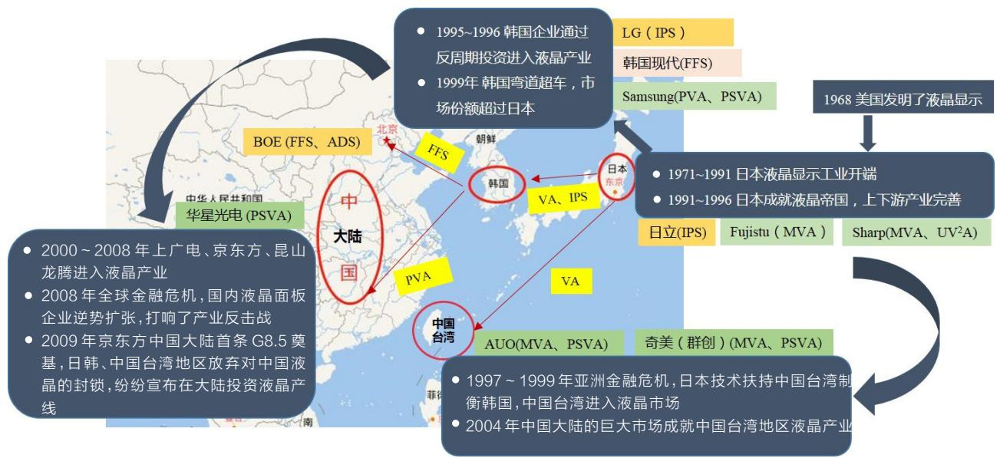  
图2 液晶显示产业布局示意图  
Fig.2 Liquid crystal display industry layout diagram

因为正性液晶在边缘电场作用下有可能倾斜排列，光效率不如负性液晶。为了改善FFS模式色偏的问题 ，Lee 等[4-5] 于 2001 年提出了 ultra FFS（UFFS）并将其应用到显示器产品中。UFFS技术将像素优化为楔形电极，采用双畴像素结构解决了色偏的问题；2004 年 BOE-Hydis 公司的 Lee 等[6] 提出了性能更优异的advanced FFS（AFFS）广视角技术，通过电动力学对楔形电极进行优化，使之具备自动抑制漏光的能力，大幅缩小了黑矩阵与像素电极间的重叠幅度，进一步提高了光透过率。结合对液晶材料的改良和优化，在正性液晶上获得负性液晶 $90 \%$ 左右的光效率，从而解决了因为负性液晶粘度大导致响应时间慢的问题；2006 年 Lim 等[7] 提出 high aperture ratio FFS（HFFS），通过将像素电极与公共电极层调换，并将公共电极与数据线交叠、平行设计，极大地提高了FFS模式的透过率，建立了中小尺寸广视角显示器件的技术平台。

在BOE-Hydis的技术研究基础上，BOE后续有针对现有FFS显示模式进行优化与创新，并形成独有的ADS显示技术。

# 1.3 ADS各代技术对比

ADS宽视角、高透光率技术主要经历了4代发展。

（1）第一代FFS技术单畴结构如图3所示。采用

透明 ITO 电极，像素开口区均可以透光，提高了 panel透过率。

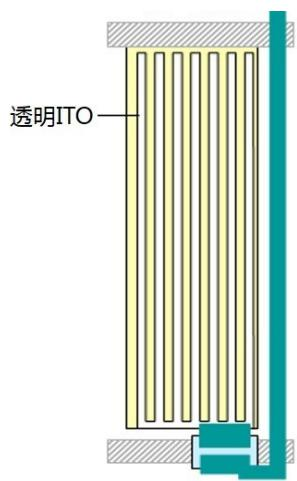  
图3 第一代FFS技术像素结构  
Fig.3 The pixel structure of the first generation FFS technology

（2）第二代 FFS 技术（ultra FFS，U-FFS）如图 4 所示。在第一代的基础上将像素改为楔形电极，采用双畴结构，在一个像素内部存在2个方向电场，驱动水平向排列的液晶同时向2个方向偏转，宏观上看2个畴的液晶叠加 ，各方向液晶产生的相位延迟（retardation）一致，从而改善了色偏。

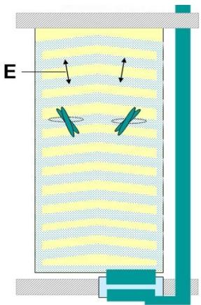  
图4 第二代FFS技术像素结构  
Fig.4 The pixel structure of the second generation FFS technology

（3）第三代 FFS 技术（advanced FFS，A-FFS）如图5所示。AFFS技术像素结构有一定的设计规格，产品都是严格按照 advanced pixel concept 来设计 ，最终目标是提高开口率、透光率、亮度和对比度。引入了先进像素概念（one pixel rule），目的是为了消除像素边缘由于楔形变形引起的暗态区域。

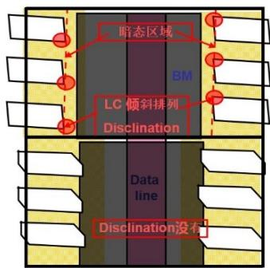  
图5 第三代FFS技术像素结构变化点  
Fig.5 The changing of pixel structure for the third generation FFS technology

变化1：改进像素边缘的LC扭转排列，提高亮度和对比度；变化2：优化像素-黑矩阵-数据线间的电动力学，减低黑矩阵尺寸，提高开口率。优化前后的像素对比图如图6所示。  
（4）第四代 FFS 技术（high aperture ratio FFS ，H-FFS）如图7所示。

H-FFS 技术相比前代技术主要变化：Pixel ITO和 Com ITO 交换位置 ，H-FFS Com ITO 在上且覆盖

了Data线，优点是可以部分屏蔽Data线与 $2 ^ { \mathrm { n d } }$ ITO 间的电场，减少漏光区，用于遮挡该区域漏光的黑矩阵(BM)宽度可以大幅度降低，开口率提升，对于小尺寸产品来说，开口率的提升更为明显。但同时 $2 ^ { \mathrm { n d } }$ ITOcom和Data线间产生了电容，增大了data线的负载，中小尺寸产品由于尺寸小负载增加少，在设计上可以接受；对于大尺寸TV来说，像素尺寸大，负载过大，难以驱动。

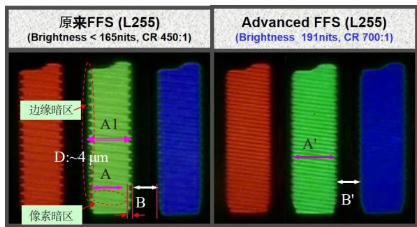  
10.4'' XGA   
设计（A1=46.5 μm，B(BM)=22 μm）, A（有效宽度 $= 4 2 . 5 up { \mu \mathrm { m } }$ ）  
A'=A+D=46.5 μm, B'(BM)=18 μm

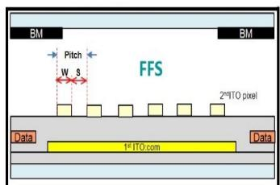  
图6 Level 255灰阶时FFS与A-FFS像素对比  
Fig.6 The comparision of FFS pixel and A-FFS pixel@gray level 255

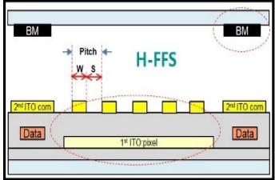  
图7 FFS与H-FFS像素横截面对比  
Fig.7 The comparision of FFS pixel and H-FFS pixel from cross section

A-FFS和H-FFS在基础像素结构上已经与目前ADS基本一致，但为了满足日益提高的透过率、高PPI、高对比度、高信赖性等要求，BOE在A-FFS和H-FFS基础上不断进行优化成为ADS技术和HADS技

术，以满足不同尺寸、不同场景的多种要求。

ADS/HADS像素结构主要优化如图8、图9所示。

（1）ADS像素中心 $2 ^ { \mathrm { n d } }$ ITO呈锯齿状交错排列进一步提升透过率；

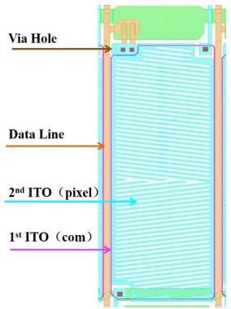  
图8ADS模式像素布局

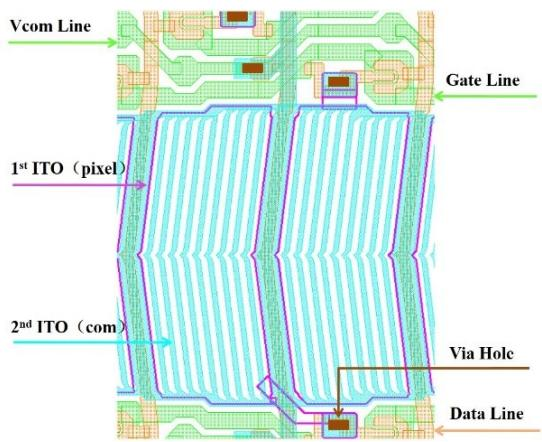  
Fig.8 The layout of ADS mode pixel   
图9 HADS模式像素布局  
Fig.9 The layout of HADS mode pixel

（2）ADS优化 $2 ^ { \mathrm { n d } }$ ITO边缘至data线距离，在保证工艺波动范围前提下进一步降低BM CD值，提升透过率；  
（3）ADS/HADS 优化 $2 ^ { \mathrm { n d } }$ ITO slit边缘拐角弯折角度与边缘弧度，改善该区域由于电场方向与液晶排列不一致引起局域性向错暗区，提升透过率，降低Trace mura 发生几率；  
（4）ADS/HADS 优化 $2 ^ { \mathrm { n d } }$ ITO 宽度( w )与 slit 宽度( s )比值 w/s ，优化像素 pitch（ $w + s \mathbf { \Theta } )$ ），保证在工艺波动范围各个像素内局部亮度变化差值最小，透过率最高，功耗最低；  
（5）ADS/HADS 优化 $2 ^ { \mathrm { n d } }$ ITO slit 角 度 ，平 衡 各 产

品对透过率、响应速度的要求；

（6）HADS 优化 Data 线上 $2 ^ { \mathrm { n d } }$ ITO com 宽 度 ，1stITO至Data线距离，降低功耗，提升透过率；  
（7）HADS 通过工艺优化 Data 线上 $2 ^ { \mathrm { n d } }$ ITO com电导率（增加金属层），降低Data线负载。

# 2 ADS技术特点

目前商用显示模式以液晶取向方式来分主要有以下3类：扭曲向列相（TN）；水平取向（IPS、ADS）；垂直取向（PVA、PSVA、MVA、UV2 A）。

# 2.1 IPS 和 ADS

同为水平取向的IPS和ADS已竞争多年，从像素结构上来看，如图10所示[8]。

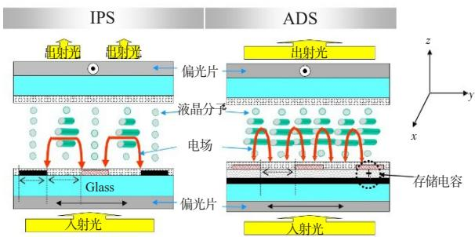  
图10 IPS与ADS像素结构及透光效率对比  
Fig.10 The comparision of pixel structure and transmittance effect between IPS and ADS

两者的光控制原理是一致的，在正交偏光片中液晶初始排列方向是与某一偏光片光轴平行的（和下偏光片平行为 e-mode，和上偏光片平行为 o-mode），此时背光源发射的光线通过下偏光片起偏，经过液晶层偏振状态不改变，被上偏光片吸收，为黑态。当液晶在电场的作用下发生水平旋转（ $x - y$ 平面）时，经过下偏光片起偏的线偏振光（ $y$ 方向偏振）经过液晶相位延迟变成椭圆偏光，具有 $x$ 方向偏振分量，此时 $y$ 方向偏振分量被上偏光片吸收，而 $x$ 方向偏振分量透过上偏光片，为白态。透过率可以由公式（1）表达

$$
T = T _ {0} \sin^ {2} (2 \varphi) \cdot \sin^ {2} (\delta / 2) \tag {1}
$$

其中 $T _ { 0 }$ 为从背光源亮度，T 为panel亮度， $\varphi$ 为液晶水平旋转角度， $\delta$ 为液晶层相位差。

$$
\delta = 2 \pi (d \Delta n) / \lambda
$$

$\Delta$ 为相位延迟量，

$$
\Delta = d (n e - n 0) = d \Delta n
$$

$d$ 为液晶层厚度， $\Delta n$ 为液晶寻常折射率与非常折射率的差值。

如图11所示，IPS模式Pixel电极和Com电极位于同一平面，仅在电极间位置具有水平偏转电场，而电极上方没有水平偏转电场，不透光。

ADS模式下，Pixel电极（上，条状）和Com电极（下，面状）分别位于不同平面，每个条状电极的两个边缘均与下方面状电极间产生边缘电场，可以驱动电极间和电极上方液晶水平旋转透光，因此ADS模式透过率更高。

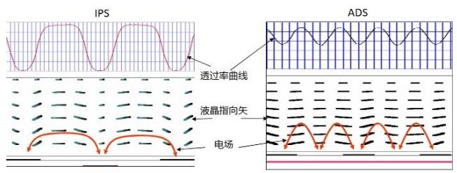  
图11 模拟IPS与ADS液晶指向矢及透光效率  
Fig.11 The simulation for liquid crystal director and transmittance between IPS and ADS

2004 年日立开发出 IPS-Pro 以改善早期 IPS 透过率低的问题，从像素结构上看IPS-Pro已经统一成ADS 模式 ，包括后来的 IPS-Pro2、IPS-Next、IPS-NEO等，如图12所示。同样现在LG IPS产品以及三星小尺寸液晶产品均为ADS模式。

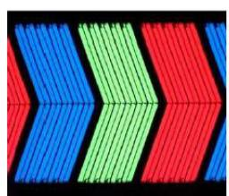

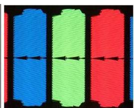

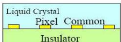  
Conventional Structure

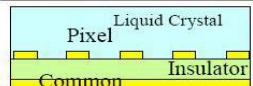  
IPS-ProStructure   
图12 传统IPS结构与IPS-Pro结构对比  
Fig.12 The pixel strcture comparision between IPS and IPS-Pro

# 2.2 高透过率

从透过率公式（1）可以看到，在其他参数不变的情况下，液晶水平旋转角度 $\varphi$ 为提升透过率的关键参数，且当 $\varphi = 4 5 ^ { \circ }$ 时有极大值。

ADS模式边缘场的存在使其盒内液晶转动更为复杂一些，既有水平分量 $E y$ ，也有垂直分量 $E z$ （假设液晶初始排列为 $x$ 方向， $E x$ 不影响其水平旋转）。

ADS模式不同电极位置 $E y$ 和 $E z$ 强度分布，如图 13 所示。可见在电极边缘 A2 位置存在极强的$E y$ ，而在电极中心A1和电极间隔中心A3 Ey 几乎为零。反之，在电极中心A1和电极间隔中心A3 $E z$ 较强，而在电极边缘A2位置几乎为零。 $E y$ 影响液晶分子的扭转角，而 $E z$ 影响液晶分子的倾斜角。

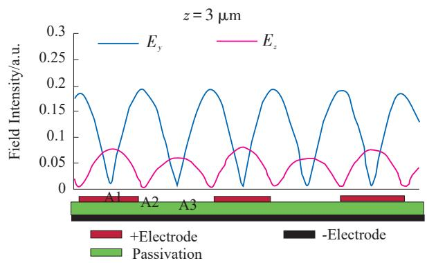  
图13电极横截面上 $E _ { y }$ 和 $E _ { z }$ 强度分布  
Fig.13 The field strength distribution of $E _ { y }$ and $E _ { z }$ on the pixel electrode cross section

如图14所示，扭转角最大值在电极边缘底部表面附近，在电极中间位置只有 $2 0 ^ { \circ } \sim 3 0 ^ { \circ }$ ；倾斜角最大可达 $2 0 ^ { \circ } \sim 3 0 ^ { \circ }$ 。

通过软件模拟不同电压下液晶指向式分布和各位置光透过率变化情况，如图15所示。中低电压时电极边缘光透过率最大，电极中心和电极间隔中心光透过率较小；接近工作电压时，电极中心和电极间隔中心光透过率在逐渐增大，而电极边缘处液晶平均扭转角已超过 $\varphi { = } 4 5 ^ { \circ }$ 的极大值，开始回落。

综上可以分析出，ADS模式存在两种液晶扭矩，一是电极边缘附件的介电扭矩，二是电极中心及电极间隔中心液晶分子自身相互作用的弹性扭矩，也在此处通过显微镜可观察到向错线。

对比TN/IPS/ADS电压-透过率（V-T）曲线，ADS亮度高于IPS，可达TN $90 \%$ 左右，如图16所示。

简单总结 IPS与ADS差异点如表1所示。

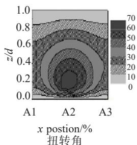

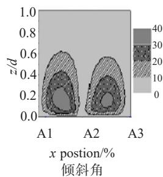  
图14 液晶分子于不同位置的扭转角和倾斜角

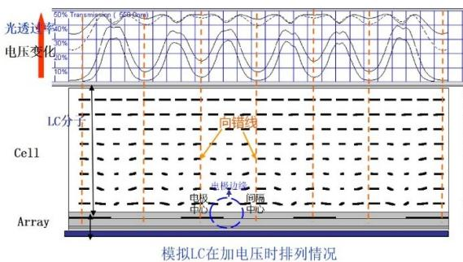  
Fig.14 Twist angle and tilt angle of LC in Y-Z plane   
图15 模拟液晶在加电压时排列情况和透过率变化情况

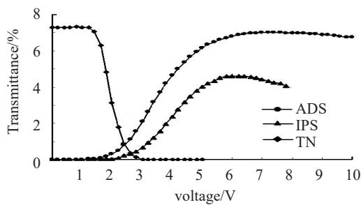  
Fig.15 The simulation for LC director and transmittance when the field changing   
图16 不同显示模式电压-透过率曲线对比  
Fig.16 The V-T curve comparision of TN/IPS/ADS mode

表1 IPS与ADS差异点  
Table 1 The difference of IPS and ADS   

<table><tr><td></td><td>IPS</td><td>ADS</td></tr><tr><td>驱动电场</td><td>Ey(低密度电场)</td><td>Ey &amp; Ez(高密度电场)</td></tr><tr><td>开关</td><td>介电扭矩</td><td>介电扭矩+弹性扭矩</td></tr><tr><td>白态液晶指向矢</td><td>水平旋转</td><td>水平旋转+垂直旋转
电极两边缘对称,自补偿</td></tr></table>

# 2.3 广视角

ADS模式液晶分子主要在水平平面旋转，从各个方向来看，光程差变化不大，透过率差异小，如图17所示。尤其是应用了双畴结构，视角在各个方向均可达到 $8 0 ^ { \circ }$ 以上。

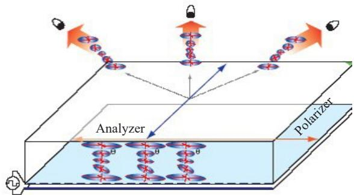  
图17 各个方向光程差变化较小  
Fig.17 The small change of retardation from different direction

# 2.4 低色偏

色偏是指随着视角变化，光的色度发生异常。其原因是随着视角变化，光程差 nd 也随之变化，导致R/G/B三色透过率比例发生变化，如图18所示。

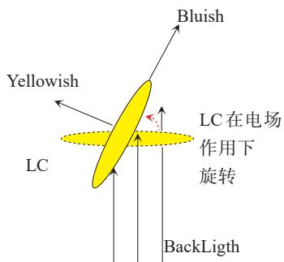  
图18 沿液晶长/短轴方向的色偏  
Fig.18 Color shift belong LC long/short axis

当 视 角 方 向 沿 液 晶 分 子 长 轴 时 ，光 程 差$\Delta n d = ~ \left( n _ { e } - n _ { o } \right)$ ） $d$ 较小，由公式（1）可知，较小波长的光透过率较高，所以看到的颜色偏蓝。

当视角方向垂直液晶分子长轴时，光程差最大，此时光程差已经超过 $\sin ^ { 2 } ( \pi d \Delta n / \lambda )$ 的极值，较大波长的光透过率较高，所以看到的颜色偏黄。

如图19所示，对于单畴结构，在不同视角存在上述偏蓝偏黄的情况，故色偏较大。对于双畴结构，两个畴的液晶分子在电场驱动下分别向相反方向转

动，宏观叠加后双畴液晶分子补偿了自身在某一方向光程差变化过大的情况，因此色偏较小。

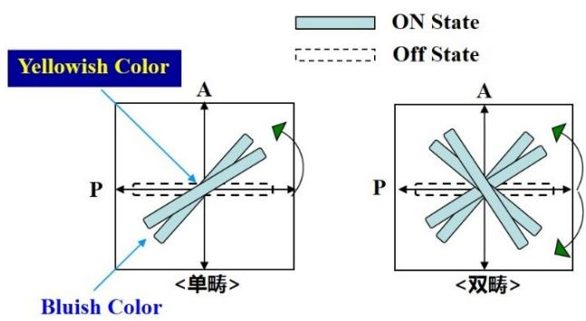  
图19 单/双畴液晶转动示意图  
Fig.19 LC rotation of one/two domain

# 3 ADS创新应用

# 3.1 触控技术

在低成本、高集成、轻薄等技术发展趋势上，触控已经由外挂式触控（add-on touch）、混合式屏内触控（hybrid in cell touch）发 展 为 全 屏 内 触 控（full incell touch），如图 20 所示。

对 比 VA 模 式 以 及 有 机 发 光 二 极 管 技 术（OLED），ADS模式特有的硬屏特性保证了其触控的可行性，同时在touch panel、信赖性、亮度、PPI等方面具有明显优势，而在对比度和响应时间方面也在积极优化，未来具有广阔应用前景，如图21所示。

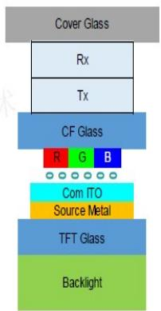  
（a）外挂式  
（a）Add-on touch

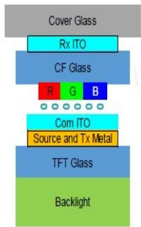  
（b）混合式  
（b）Hybrid in cell touch

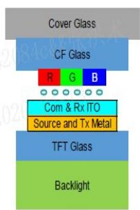  
(c)全屏内触控   
(c) Full in cell   
touch   
图20 3种主要触控技术  
Fig.20 Structures of 3 major touch technologies

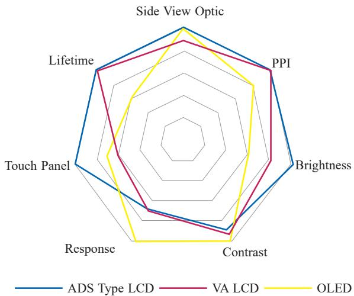  
图21 不同模式/种类产品显示性能对比  
Fig.21 Display performance comparison in summarize

# 3.2 BD Cell[8-9]

人们对屏幕显示质量要求日益提高，纯黑画面、精细高动态响应范围（fine HDR）已经成为高端显示屏必备配置。

2019 年 ，京东方研发了一款 65 in UHD BD Cell（dual cell local dimming）对 标 目 前 主 流 的 直 下 式LED (D-LED)local dimming 技术。具有超高对比度1 5000：1，百万级的控光单元数，产品显示细腻度大大超过D-LED控光方案；同时普通E-LED $^ +$ dual cell结构，相对D-LED $^ +$ single cell 结构的模组厚度大大降低，使产品外观更加美观，并于2019年SID上获得People ’s choice Best New Display Technology 大奖。

BD Cell包含了两层液晶屏，其主屏选用了65 inUHDADS cell，而副屏（控光）的选择上则综合对比了ADS和HADS的技术细节，为了最大化副屏的透过率以及防止主副屏间的摩尔纹干涉，选择了65 in FHDHADS cell作为BD Cell中的副屏，如图22所示。

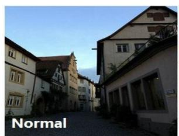

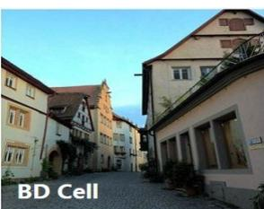  
图22 普通显示屏和BD Cell显示效果对比  
Fig.22 The display performance comparision of normal and BD Cell

在保证显示质量，控制摩尔纹方面则创新性发明折线型像素结构[10] ，通过Matlab软件模拟量化处理可得到CS（明暗对比度的倒数）和CPD（一定周期内的条纹数），二者均为值越大，摩尔纹越轻微，如图23所示。

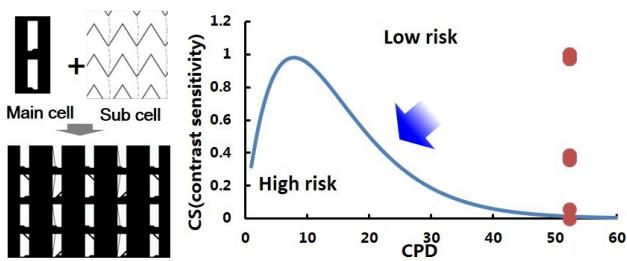  
图23 Matlab模拟摩尔纹风险  
Fig.23 Simulate moire occurrence risk by Matlab

# 4 结 论

本文通过液晶显示行业布局史引入ADS技术的由来、发展与创新，阐述了ADS技术作为水平取向液晶模式唯一最终选择，具有高透过率、大视角、低色偏等技术特点。而面对VA模式的竞争以及OLED技术的挑战，ADS技术也在扩大应用场景（全屏内触控）以及开发高端产品（BD Cell）等方面做出了不断的努力，相信未来很长一段时间ADS技术仍能站稳市场份额并不断发展下去。

# 参考文献

[ 1 ] 马群刚. TFT-LCD原理与设计[M]. 北京:电子工业出版社, 2011.  
MA Q G. TFT- LCD principle and design[M]. Beijing: Publishing House of Electronics Industry, 2011.

[2] 路风. 光变[M]. 北京：当代中国出版社, 2016. LU F. The change of light[M]. Beijing: Contemporary China Publishing House, 2016.   
[ 3 ] LEE S H, LEE S L, KIM H Y. Electro-optic characteristics and switching principle of a nematic liquid crystal cell controlled by fringe- field switching[J]. Appl. Phys. Lett, 1998, 73(20): 2881-2883.   
[ 4 ] LEE S H, LEE S M, KIM H Y, et al. 18.1 ultra-FFS TFT-LCD with super image quality and fast response time[J]. SID 01 Digest, 2001, 32(1): 484-487.   
[ 5 ] LEE S H, LEE S M, KIM H Y, et al. Ultra-FFS TFT-LCD with super image quality, fast response time, and strong press- resistant characteristics[J]. Journal of the Society for Information Display, 2002, 10(2): 117-122.   
[ 6 ] LEE K H, KIM H Y, SONG S H, et al. Super-high performance of 12.1-in. XGA tablet PC and 15-in. UXGA panel with advanced pixel concept[J]. SID 04 Digest, 2004, 34(1):1102-1105.   
[ 7 ] LIM D H, LEE H Y, KIM J P, et al. High performance mobile application with the high aperture ratio FFS (HFFS) [C]// IDW ’06: $1 3 ^ { \mathrm { t h } }$ International Display Workshop (IDW 06). IDW, 2006: 807-808.   
[ 8 ] 占红明, 邵喜斌, 张瑞辰,等 . 显示装置: CN108957841A[P]. 2018-12-07.ZHAN H M, SHAO X B, ZHANG R C, et al. Displaydevice: CN108957841A[P]. 2018-12-07.  
[ 9 ] LIU H , ZHAN H M , ZHANG R C , et al. Dual cell ultrahigh contrast ratio display[C]. IMID 2019 Digest, 2019: 358.   
[10] 刘浩, 张瑞辰, 占红明, 等. 显示面板及显示装置:CN108983463A [P]. 2018-12-11.LIU H, ZHANG R C, ZHAN H M, et al. Display paneland display device: CN108983463A [P]. 2018-12-11.